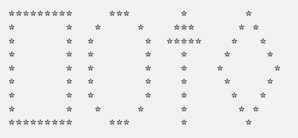
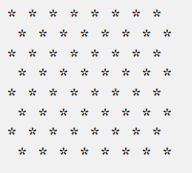
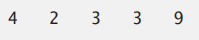
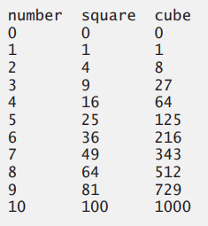
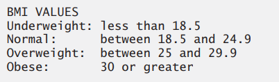

# Exercise
Questions on the concepts covered in the section

## CONCEPT QUESTIONS
1. (Arithmetic) Write an application that asks the user to enter two integers, obtains them from the user and prints their sum, product, difference and quotient (division).
2. (Comparing Integers) Write an application that asks the user to enter two integers, obtains them from the user and displays the larger number followed by the words "is larger". If the numbers are equal, print the message "These numbers are equal".
3. (Arithmetic, Smallest and Largest) Write an application that inputs three integers from the user and displays the sum, average, product, smallest and largest of the numbers. [Note: The calculation of the average in this exercise should result in an integer representation of the average. So, if the sum of the values is 7, the average should be 2, not 2.3333….]
4. (Displaying Shapes with Asterisks) Write an application that displays a box, an oval, an arrow and a diamond using asterisks (*), as follows:

5. (Largest and Smallest Integers) Write an application that reads five integers and determines and prints the largest and smallest integers in the group.
6. (Odd or Even) Write an application that reads an integer and determines and prints whether it’s odd or even. [Hint: Use the remainder operator. An even number is a multiple of 2. Any multiple of 2 leaves a remainder of 0 when divided by 2.]
7. (Multiples) Write an application that reads two integers, determines whether the first is a multiple of the second and prints the result. [Hint: Use the remainder operator.]
8. (Checkerboard Pattern of Asterisks) Write an application that displays a checkerboard pattern, as follows:

9. <p>(Diameter, Circumference and Area of a Circle) Here’s a peek ahead. In this chapter, you learned about integers and the type int. Java can also represent floating-point numbers that contain decimal points, such as 3.14159. Write an application that inputs from the user the radius of a circle as an integer and prints the circle’s diameter, circumference and area using the floating-point value 3.14159 for π. [Note: You may also use the predefined constant Math.PI for the value of π. This constant is more precise than the value 3.14159. Class Math is defined in package java.lang. Classes in that package are imported automatically, so you do not need to import class Math to use it.] Use the following formulas (r is the radius):</p>
    <p> diameter = 2r </p>
    <p> circumference = 2πr </p> 
    <p> area = πr2 </p>
    <p>Do not store the results of each calculation in a variable. Rather, specify each calculation as the value that will be output in a System.out.printf statement. The values produced by the circumference and area calculations are floating-point numbers. Such values can be output with the format specifier %f in a System.out.printf statement.</p>
10. <p>(Integer Value of a Character) Here’s another peek ahead. In this chapter, you learned about integers and the type int. Java can also represent uppercase letters, lowercase letters and a considerable variety of special symbols. Every character has a corresponding integer representation. The set of characters a computer uses together with the corresponding integer representations for those characters is called that computer’s character set. You can indicate a character value in a program simply by enclosing that character in single quotes, as in 'A'.</p> 
    <p>You can determine a character’s integer equivalent by preceding that character with (int), as in (int) 'A'.</p> 
    <p>An operator of this form is called a cast operator. The following statement outputs a character and its integer equivalent:</p>

    ```java
    System.out.printf("The character %c has the value %d%n", 'A', ((int) 'A')); 
    ```
    <p>When the preceding statement executes, it displays the character A and the value 65 (from the Unicode® character set) as part of the string. The format specifier %c is a placeholder for a character (in this case, the character 'A'). </p>
    <p>Using statements similar to the one shown earlier in this exercise, write an application that displays the integer equivalents of some uppercase letters, lowercase letters, digits and special symbols. Display the integer equivalents of the following: A B C a b c 0 1 2 $ * + / and the blank character</p>
11. (Separating the Digits in an Integer) Write an application that inputs one number consisting of five digits from the user, separates the number into its individual digits and prints the digits
separated from one another by three spaces each. For example, if the user types in the number 42339,
the program should print:

    <p>Assume that the user enters the correct number of digits. What happens when you enter a number with more than five digits? What happens when you enter a number with fewer than five digits? [Hint: It’s possible to do this exercise with the techniques you learned in this chapter. You’ll need to use both division and remainder operations to “pick off” each digit.] </p>

12. (Table of Squares and Cubes) Using only the programming techniques you learned in this
chapter, write an application that calculates the squares and cubes of the numbers from 0 to 10 and
prints the resulting values in table format, as shown below


13. (Negative, Positive and Zero Values) Write a program that inputs five numbers and determines and prints the number of negative numbers input, the number of positive numbers input and
the number of zeros input.

## MAKING A DIFFERENCE
14. The formulas for calculating BMI are:
```math
BMI = \frac{weightInPounds \times 703}{heightInInches \times heightInInches}
```
or
```math
BMI = \frac{weightInKilograms}{heightInMeters \times heightInMeters}
```
Create a BMI calculator that reads the user’s weight in pounds and height in inches (or, if you prefer, the user’s weight in kilograms and height in meters), then calculates and displays the user’s
body mass index. Also, display the following information from the Department of Health and
Human Services/National Institutes of Health so the user can evaluate his/her BMI:


15. (World Population Growth Calculator) Use the web to determine the current world population and the annual world population growth rate. Write an application that inputs these values,
then displays the estimated world population after one, two, three, four and five years. 

16. (Car-Pool Savings Calculator) Research several car-pooling websites. Create an application
that calculates your daily driving cost, so that you can estimate how much money could be saved by
car pooling, which also has other advantages such as reducing carbon emissions and reducing traffic
congestion. The application should input the following information and display the user’s cost per day of driving to work: 
    <p>a) Total miles driven per day.</p> 
    <p>b) Cost per gallon of gasoline.</p> 
    <p>c) Average miles per gallon.</p>
    <p>d) Parking fees per day.</p> 
    <p>e) Tolls per day</p>