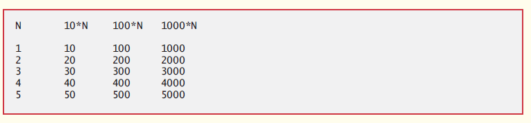
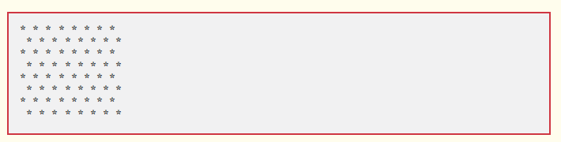

# EXERCISE
Questions on concepts covered in the section.

## QUESTIONS
For 1 through 4, perform each of the following steps:
- Read the problem statement.
- Formulate the algorithm using pseudocode and top-down, stepwise refinement.
- Write a Java program.
- Test, debug and execute the Java program.
- Process three complete sets of data.
1. (Gas Mileage) Drivers are concerned with the mileage their automobiles get. One driver has kept track of several trips by recording the miles driven and gallons used for each tankful. Develop a Java application that will input the miles driven and gallons used (both as integers) for each trip. The program should calculate and display the miles per gallon obtained for each trip and print the combined miles per gallon obtained for all trips up to this point. All averaging calculations should produce floating-point results. Use class Scanner and sentinel-controlled repetition to obtain the data from the user.
2. (Credit Limit Calculator) Develop a Java application that determines whether any of several department-store customers has exceeded the credit limit on a charge account. For each customer, the following facts are available:
    - account number
    - balance at the beginning of the month
    - total of all items charged by the customer this month
    - total of all credits applied to the customer’s account this month
    - allowed credit limit.
The program should input all these facts as integers, calculate the new balance,:
    ```math
        new balance = beginning balance + charges - credits
    ```
    display the new balance and determine whether the new balance exceeds the customer’s credit limit. For those customers whose credit limit is exceeded, the program should display the message "Credit limit exceeded".

3. (Sales Commission Calculator) A large company pays its salespeople on a commission basis. The salespeople receive $200 per week plus 9% of their gross sales for that week. For example, a salesperson who sells $5,000 worth of merchandise in a week receives $200 plus 9% of $5000, or a total of $650. You’ve been supplied with a list of the items sold by each salesperson. The values of these items are as follows:
Item | Value
------ | ------
1 | 239.99
2 | 129.75
3 | 99.95
4 | 350.89
Develop a Java application that inputs one salesperson’s items sold for last week and calculates and displays that salesperson’s earnings. There’s no limit to the number of items that can be sold.
4. (Salary Calculator) Develop a Java application that determines the gross pay for each of three employees. The company pays straight time for the first 40 hours worked by each employee and time and a half for all hours worked in excess of 40. You’re given a list of the employees, their number of hours worked last week and their hourly rates. Your program should input this information for each employee, then determine and display the employee’s gross pay. Use class Scanner to input the data.
5. (Find the Largest Number) The process of finding the largest value is used frequently in computer applications. For example, a program that determines the winner of a sales contest would input the number of units sold by each salesperson. The salesperson who sells the most units wins the contest. Write a pseudocode program, then a Java application that inputs a series of 10 integers and determines and prints the largest integer. Your program should use at least the following three variables:
    - counter: A counter to count to 10 (i.e., to keep track of how many numbers have been input and to determine when all 10 numbers have been processed).
    - number: The integer most recently input by the user.
    - largest: The largest number found so far.
6. (Tabular Output) Write a Java application that uses looping to print the following table of values:

7. (Find the Two Largest Numbers) Using an approach similar to that for Q5, find the two largest values of the 10 values entered. [Note: You may input each number only once.]
8. Modify the program:
   ```java
    1. //Analysis of examination results using nested control statements
    2. import java.util.Scanner;  //class uses class Scanner
    3. 
    4. public class Analysis
    5. {
    6.      public static void main(String[] args)
    7.      {
    8.              //create Scanner to obtain input from command window
    9.              Scanner input = new Scanner(System.in);
    10.     
    11.             //initializing variables in declarations
    12.             int passes = 0;
    13.             int failures = 0;
    14.             int studentCounter = 1;
    15.             
    16.             //process 10 students using counter-controlled loop
    17.             while(studentCounter <= 10)
    18.             {
    19.                 //prompt user for input and obtain value from user
    20.                 System.out.print("Enter result (1 = pass, 2 = fail):");
    21.                 int result = input.nextInt();
    22.             
    23.                 //if...else is nested in the while statement
    24.                 if(result == 1)
    25.                    passes = passes + 1;
    26.                 else
    27.                    failures = failures + 1;
    28.                 
    29.                 //increment studentCounter so loop eventually terminates
    30.                 studentCounter = studentCounter + 1;
    31.             }
    32.             
    33.             //termination phase; prepare and display results
    34.             System.out.printf("Passed: %d%nFailed: %d%n", passes, failures);
    35.             
    36.             //determine whether more than 8 students passes
    37.             if(passses > 8)
    38.                System.out.println("Bonus to instructor!");
    39.             } //end main
    40. } //end class Analysis
    ```
    to validate its inputs. For any input, if the value entered is other than 1 or 2, keep looping until the user enters a correct value
9. (Square of Asterisks) Write an application that prompts the user to enter the size of the side of a square, then displays a hollow square of that size made of asterisks. Your program should work for squares of all side lengths between 1 and 20.
10. (Palindromes) A palindrome is a sequence of characters that reads the same backward as forward. For example, each of the following five-digit integers is a palindrome: 12321, 55555, 45554 and 11611. Write an application that reads in a five-digit integer and determines whether it’s a palindrome. If the number is not five digits long, display an error message and allow the user to enter a new value.
11. (Printing the Decimal Equivalent of a Binary Number) Write an application that inputs an integer containing only 0s and 1s (i.e., a binary integer) and prints its decimal equivalent. [Hint: Use the remainder and division operators to pick off the binary number’s digits one at a time, from right to left. In the decimal number system, the rightmost digit has a positional value of 1 and the next digit to the left a positional value of 10, then 100, then 1000, and so on. The decimal number 234 can be interpreted as 4 * 1 + 3 * 10 + 2 * 100. In the binary number system, the rightmost digit has a positional value of 1, the next digit to the left a positional value of 2, then 4, then 8, and so on. The decimal equivalent of binary 1101 is 1 * 1 + 0 * 2 + 1 * 4 + 1 * 8, or 1 + 0 + 4 + 8 or, 13.]
12. (Checkerboard Pattern of Asterisks) Write an application that uses only the output statements
    <p>System.out.print("* ");</p>
    <p>System.out.print(" ");</p>
    <p>System.out.println();</p>
    to display the checkerboard pattern that follows. A System.out.println method call with no arguments causes the program to output a single newline character. [Hint: Repetition statements are required,]
    
13. (Sides of a Triangle) Write an application that reads three nonzero values entered by the user and determines and prints whether they could represent the sides of a triangle
14. (Sides of a Right Triangle) Write an application that reads three nonzero integers and determines and prints whether they could represent the sides of a right triangle.
15. (Factorial) The factorial of a nonnegative integer n is written as n! (pronounced “n factorial”) and is defined as follows:
n! = n · (n – 1) · (n – 2) · … · 1 (for values of n greater than or equal to 1)
and
n! = 1 (for n = 0)
For example, 5! = 5 · 4 · 3 · 2 · 1, which is 120.
- Write an application that reads a nonnegative integer and computes and prints its factorial.
- Write an application that estimates the value of the mathematical constant e by using the following formula.   Allow the user to enter the number of terms to calculate.
- Write an application that computes the value of ex by using the following formula. Allow the user to enter the number of terms to calculate.

### MAKING A DIFFERENCE
16. (Enforcing Privacy with Cryptography) The explosive growth of Internet communications and data storage on Internet-connected computers has greatly increased privacy concerns. The field of cryptography is concerned with coding data to make it difficult (and hopefully—with the most advanced schemes—impossible) for unauthorized users to read. In this exercise you’ll investigate a simple scheme for encrypting and decrypting data. A company that wants to send data over the Internet has asked you to write a program that will encrypt it so that it may be transmitted more securely. All the data is transmitted as four-digit integers. Your application should read a four-digit integer entered by the user and encrypt it as follows: Replace each digit with the result of adding to the digit and getting the remainder after dividing the new value by 10. Then swap the first digit with the third, and swap the second digit with the fourth. Then print the encrypted integer. Write a separate application that inputs an encrypted four-digit integer and decrypts it (by reversing the encryption scheme) to form the original number. [Optional reading project: Research “public key cryptography” in general and the PGP (Pretty Good Privacy) specific public key scheme. You may also want to investigate the RSA scheme, which is widely used in industrial-strength applications.]
17. (World Population Growth) World population has grown considerably over the centuries. Continued growth could eventually challenge the limits of breathable air, drinkable water, arable cropland and other limited resources. There’s evidence that growth has been slowing in recent years and that world population could peak some time this century, then start to decline. For this exercise, research world population growth issues online. Be sure to investigate various viewpoints. Get estimates for the current world population and its growth rate (the percentage by which it’s likely to increase this year). Write a program that calculates world population growth each year for the next 75 years, using the simplifying assumption that the current growth rate will stay constant. Print the results in a table. The first column should display the year from year 1 to year 75. The second column should display the anticipated world population at the end of that year. The third column should display the numerical increase in the world population that would occur that year. Using your results, determine the year in which the population would be double what it is today, if this year’s growth rate were to persist.