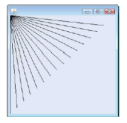
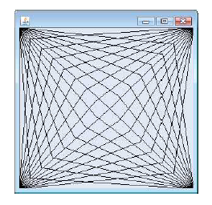
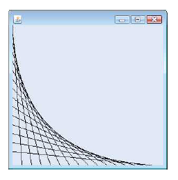
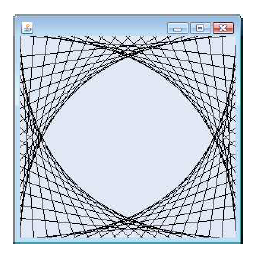

# EXERCISE
Questions on the concepts covered during the session

## QUESTIONS
1. Modify the addition program:
    ```java
    1. //Addition program that inputs two numbers and displays their sum
    2. import java.util.Scanner; //program uses class Scanner
    3. 
    4. public class Addition
    5. {
    6.       //main method begins execution of Java application
    7.      public static void main(String[] args)
    8.      {
    9.          //create a Scanner to obtain input from the command window
    10.          Scanner input = new Scanner(System.in);
    11.
    12.            int number1; //first number to add
    13.            int number2; //second number to add
    14.            int sum; //sum of number1 and number2
    15.
    16.            System.out.print("Enter first integer: "); //prompt
    17.            number1 = input.nextInt(); //read first number from user
    18.
    19.            System.out.print("Enter second integer: "); //prompt
    20.            number2 = input.nextInt(); //read second number from user
    21.
    22.            sum = number1 + number2; //add numbers, then store total in sum
    23.
    24.            System.out.printf("Sum is %d%n", sum); //display sum
    25.     }
    26. }
    ```
    to use dialog-based input and output with the methods of class JOptionPane. Since method showInputDialog returns a String, you must convert the String from the user to get int for use in calculations. The static method parseInt of class Integer (package java.lang) takes a String argument representing an integer and returns the value as an int. If the String doesn't contain a valid integer, the program will terminate with an error.

2. Question two:
    1. Using loops and control statements to draw lines can lead to many interesting designs:
        - Create the design in the figure below.
        
        This design draws lines from the top-left corner, fanning them out until they cover the upper-left half of the panel. One approach is to divide the width and height into an equal number of steps (we found 
        15 steps worked well). The first endpoint of a line will always be in the top-left corner (0, 0). The second endpoint can be found by starting at the bottom-left corner and moving up one vertical step and right one horizontal step. Draw a line between the two endpoints. Continue moving up and to the right one step to find each successive endpoint. The figure should scale accordingly as you resize the window.
        - Modify the first part of 1 to have lines fan out from all four corners, as shown in the figure below. Lines from opposite corners should intersect along the middle.
        
    2. Designs created using while loops and drawLine
        - Create the design in the figure below. Begin by dividing each edge into an equal number of increments (we chose 15 again). The first line starts in the topleft corner and ends one step right on the bottom edge. For each successive line, move down one increment on the left edge and right one increment on the bottom edge. Continue drawing lines until you reach the bottom-right corner. The figure should scale as you resize the window so that the endpoints always touch the edges.
        
        - Modify your asnwer in the first part of 2 to mirror the design in all four corners, as shown in the figure below.
        